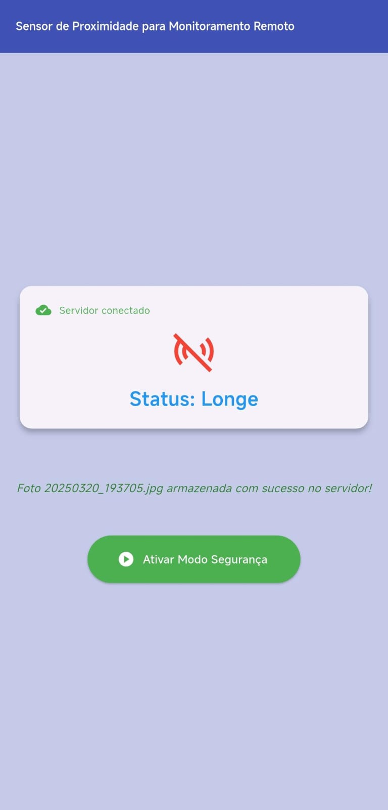
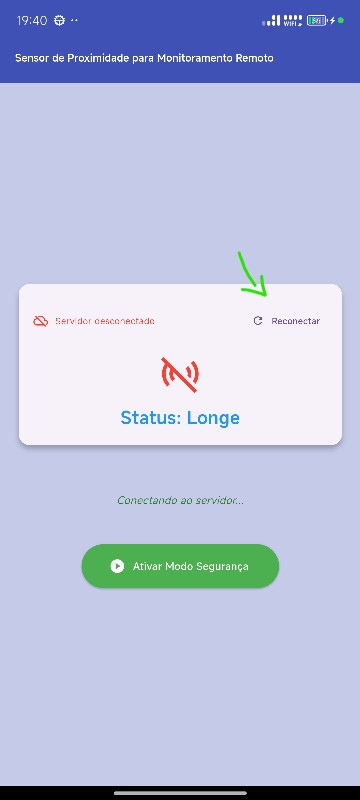
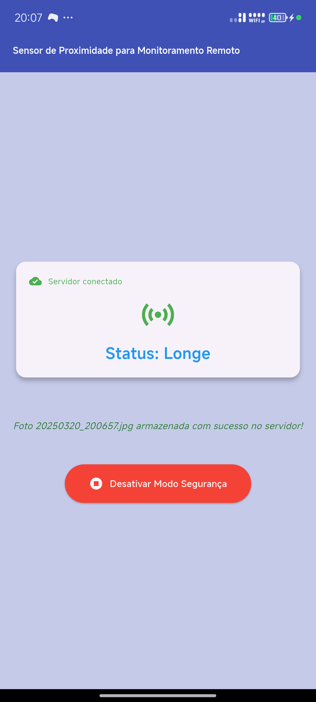
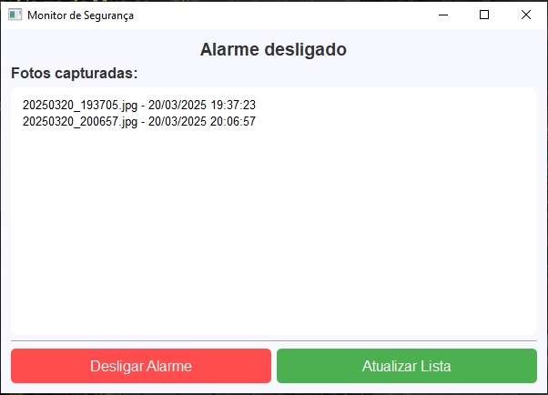

# Sensor de Proximidade para Monitoramento Remoto

## 📖 Descrição

Este projeto é um plicativo Android que utilize o sensor de proximidade para ativar um modo de segurança. Quando o sensor detectar movimento, um sinal de alerta será enviado a um servidor Python rodando em um notebook, acionando um alarme sonoro ininterrupto. Além disso, o aplicativo capturará uma foto do intruso e enviará ao servidor, que armazenará a imagem para consulta posterior.

## ⚙️ Tecnologias Utilizadas

### Linguagens e Frameworks

- **Python** – Linguagem de programação ultilizada no servidor
- **Flutter** – Framework para desenvolvimento do aplicativo
- **Dart** – Linguagem de programação do Flutter.

### Pacotes e Bibliotecas Utilizadas

**Aplicativo:**

- proximity_sensor: Para detectar proximidade do dispositivo.
- camera: Para acessar a câmera do dispositivo.
- path_provider: Para obter diretórios do sistema, como armazenamento temporário e permanente.
- path: Para manipular caminhos de arquivos de forma cross-platform.
- permission_handler: Para gerenciar permissões do sistema, como câmera e armazenamento.
- crypto: Para criptografia e hashing de dados (MD5, SHA-256, etc.).
- flutter/services.dart: Para comunicação com serviços nativos do sistema operacional.

**Servidor:**

- socket: Para comunicação via TCP/IP entre cliente e servidor.
- pygame: Para reprodução de áudio do alarme.
- sys e os: Para manipulação do sistema de arquivos e operações do sistema operacional.
- base64 e hashlib: Para codificação e decodificação de imagens, além de gerar hash para verificação de integridade.
- datetime: Para trabalhar com datas e timestamps.
- PyQt5 (QtCore, QtGui, QtWidgets): Para criar a interface gráfica do monitor de segurança.
- threading (Thread, Lock): Para gerenciar threads e sincronização de acesso a recursos compartilhados.
- time: Para gerenciar intervalos e tempos de espera.

### APIs e Funcionalidades

- Sockets (dart:io) – Comunicação com um servidor via TCP.
- Timers (dart:async) – Execução de tarefas periódicas.
- JSON (dart:convert) – Codificação e decodificação de dados em JSON.

## 📌 Guia de Instalação e Uso

### 1️⃣ Instalar Python 3.11.6

O **Python 3.11.6** foi escolhido porque versões mais recentes, como o **Python 3.13**, podem apresentar incompatibilidade com o **PyQt5** devido a mudanças internas na API. Algumas versões mais antigas do PyQt5 podem não funcionar corretamente no Python 3.13, exigindo um downgrade para **Python 3.11.6**.

🔹 Baixe e instale o Python 3.11.6 no link abaixo:  
[🔗 Download Python 3.11.6](https://www.python.org/downloads/release/python-3116/)

### 2️⃣ Clonar o Repositório

Para obter o código do projeto, clone o repositório com:

```sh
git clone git@github.com:lannyily/sensor-sistemas-distribuidos.git
```

### 3️⃣ Instalar as Bibliotecas

Após clonar o projeto, instale todas as dependências necessárias executando:

```sh
pip install -r requirements.txt
```

### 4️⃣ Configurar o Emulador ou um Dispositivo Real

Para testar o aplicativo, utilize um **emulador Android** ou um **dispositivo físico** com modo desenvolvedor ativado.

### 5️⃣ Configurar o Endereço IP

Para que o aplicativo consiga se conectar ao servidor corretamente, você deve definir o **endereço IP** do servidor.

1️⃣ No **Windows**, descubra o seu IP executando o seguinte comando no terminal (CMD):

```sh
ipconfig
```

2️⃣ No arquivo **`sensordeaproximidade/lib/main.dart`**, localize a **linha 432** e substitua `"IP_DO_SERVIDOR"` pelo IP correto:

```dart
final List<String> possibleIps = [
    "IP_DO_SERVIDOR", // IP original
    "localhost",       // Nome simbólico
    "127.0.0.1",       // localhost numérico
    //"10.0.2.2",      // Emulador Android -> localhost
];
```

💡 **Dica:** Se estiver testando no **emulador Android**, use `"10.0.2.2"` para acessar o localhost do seu PC.

### 6️⃣ Executar o Servidor

Antes de rodar o código, é importante abrir a pasta do servidor como raiz no terminal.

1️⃣ Acesse o diretório do servidor:

```sh
cd caminho/para/a/pasta/do/servidor
```

2️⃣ Agora, execute o servidor com:

```sh
python server.py
```

💡 **Observação:** Certifique-se de estar na pasta correta antes de rodar o comando, pois ele depende dos arquivos e diretórios dentro da pasta do servidor.

## 🛠️ Funcionamento

O aplicativo possui uma tela inicial com um botão para ativar e desativar o sensor de proximidade. Quando ativado, o sensor detecta movimento e captura uma foto automaticamente. Esse processo ocorre de forma independente, sem necessidade de conexão com o servidor.



Na parte superior do aplicativo, há um botão para estabelecer conexão com o servidor, caso ainda não esteja conectada. A foto capturada só é enviada ao servidor se a conexão estiver ativa.



Quando o servidor detecta movimento, ele ativa um alarme, que só pode ser desligado manualmente na interface do servidor. Essa interface contém:

- Um botão para desligar o alarme;
- Um botão para atualizar os dados;
- Uma lista de imagens capturadas pelo servidor.

As fotos capturadas pelo aplicativo são enviadas e armazenadas na pasta "fotos" do servidor.




# Estrutura do Projeto

## sensor-sistemas-distribuidos/

├── sensordeaproximidade/ # Diretório do aplicativo Flutter  
│   ├── lib/ # Código fonte do aplicativo  
│   │   ├── main.dart # Ponto de entrada do aplicativo  
│   │   ├── screens/ # Telas do aplicativo  
│   │   │   ├── home_screen.dart # Tela inicial  
│   │   │   ├── settings_screen.dart # Tela de configurações  
│   │   ├── widgets/ # Widgets reutilizáveis  
│   │   ├── services/ # Serviços de comunicação com o servidor  
│   │   └── models/ # Modelos de dados  
│   ├── pubspec.yaml # Dependências do Flutter  
│   └── ... # Outros arquivos do Flutter  
│  
├── servidor/ # Diretório do servidor Python  
│   ├── server.py # Código principal do servidor  
│   ├── requirements.txt # Dependências do servidor  
│   ├── audio/ # Arquivos de áudio (ex: alarme)  
│   ├── fotos/ # Diretório para armazenar fotos recebidas  
│   └── ... # Outros arquivos do servidor  
│  
├── README.md # Documentação do projeto  

## Principais Módulos  

### Aplicativo Flutter (`sensordeaproximidade/`)  
- **`lib/`**: Contém o código fonte do aplicativo.  
  - **`main.dart`**: Ponto de entrada do aplicativo, onde a aplicação é inicializada.  
  - **`screens/`**: Contém as diferentes telas do aplicativo, como a tela inicial e a tela de configurações.  
  - **`widgets/`**: Widgets reutilizáveis que podem ser usados em várias telas.  
  - **`services/`**: Serviços que gerenciam a comunicação com o servidor, como envio de fotos e recebimento de dados.  
  - **`models/`**: Estruturas de dados que representam as informações usadas no aplicativo.  
- **`pubspec.yaml`**: Lista de dependências do Flutter.  

### Servidor Python (`servidor/`)  
- **`server.py`**: Código principal que gerencia as conexões de clientes, recebe fotos e ativa alarmes.  
- **`requirements.txt`**: Lista de dependências necessárias para o servidor.  
- **`audio/`**: Contém arquivos de áudio, como o som do alarme.  
- **`fotos/`**: Diretório onde as fotos recebidas são armazenadas.  
